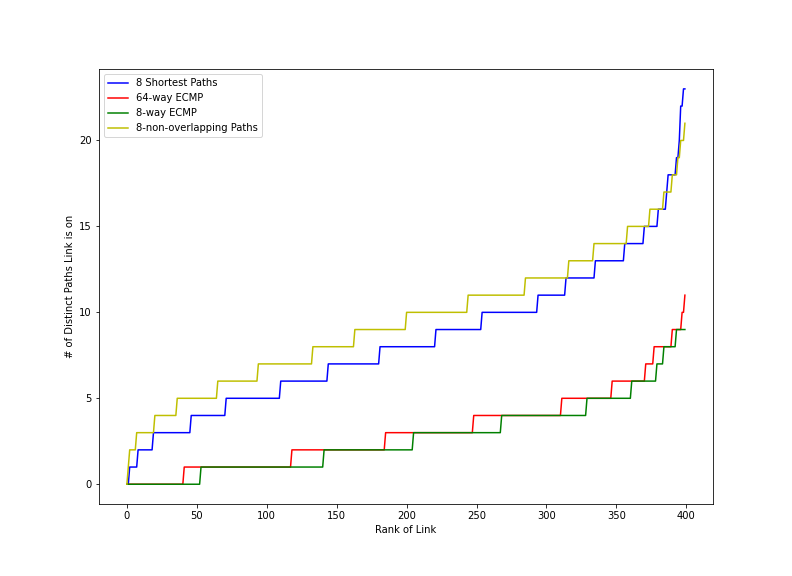
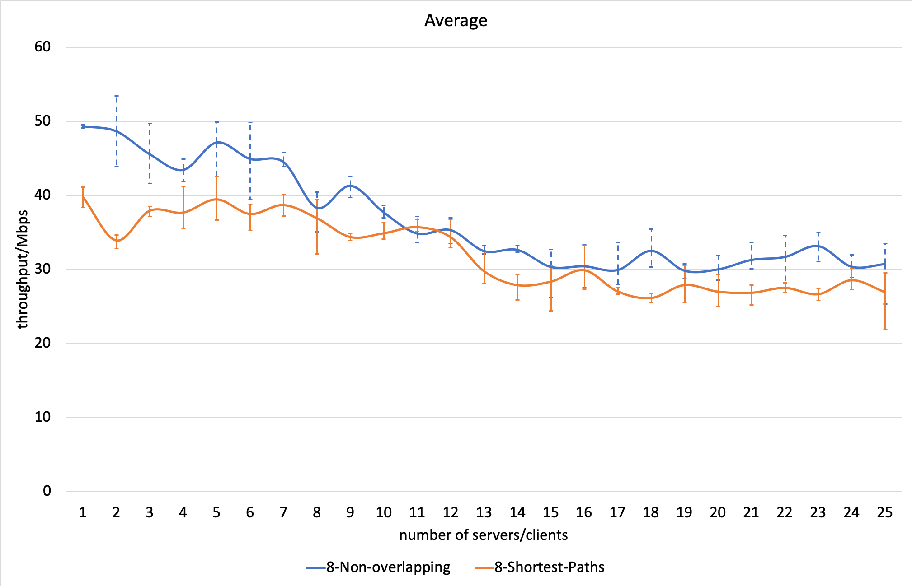

# k-non-overlapping Path Algorithm 

[slides](https://docs.google.com/presentation/d/1iPXMhChZSoxUF0wdVdqB6OcjMytnGAiv8M9-n3hED6o/edit?usp=sharing) and [video](https://www.dropbox.com/s/rq6bazvvpa3kb3w/Non-overlapping%20algorithm.mp4?dl=0)

## Motivation
The high capacity mentioned in the [Jellyfish paper](https://www.usenix.org/system/files/conference/nsdi12/nsdi12-final82.pdf) inspires us to explore its potential to tackle burst flow. We want to maximize the average throughput at the expense of tolerable latency.


## Progress

We put forward and implemented a new routing algorithm named **k-non-overlapping Path**, which guarantees all links on paths from A to B have no overlapping.

This repository implements and tests non-overlapping path algorithm in Jellyfish Network.

### Path Diversity

Jellyfish network with 50 switches (8 for peer switches and 1 for host). Based on Jellyfish Paper Figure 9.

Check this to [this](./RunInVM.pdf) to know how to run [Jupyter Note](./build_topology.ipynb) in Google cloud to reproduce it.  **python 3** is needed.




### Average Throughput per Server

Jellyfish network with 50 switches
(8 ports connecting peer switches and 1 for host). Links between switches are 10 Mbps.

The result is subject to lots of factors and may differ in another machine and/or randomness.

| Routing Algorithm | 10 Servers / 10 Clients | 15 Servers / 15 Clients | 20 Servers / 20 Clients | 25 Servers / 25 Clients |
| ----------------- | ----------------------- | ----------------------- | :---------------------: | :---------------------: |
| 8-Non-overlapping | 38.68  Mbps (↑13.2%)    | 32.7  Mbps (↑8.6%)      |   29.75 Mbps (↑19.1%)   |   25.35 Mbps (↑16.0%)   |
| 8-Shortest-Paths  | 34.19  Mbps             | 30.1  Mbps              |       24.98 Mbps        |       21.83 Mbps        |





## Build

**Python 2** is used for below instruction.

### Creating Environment

The most recommended way to reproduce it is using [google computer engine](https://cloud.google.com/compute); We provided a public image for the whole test environment. Simply run in [google cloud shell](https://cloud.google.com/shell):

```
gcloud compute instances create [VM Name] --image non-overlapping --image-project winter-cargo-272015
```

and then you are all set. 

Any questions, please check documents on [Creating an instance with an image shared with you](https://cloud.google.com/compute/docs/instances/create-start-instance#sharedimage). You may want to create a high-performance VM for the following experiments.

Alternatively, if you would like to build it from scratch, you should install [Mininet](https://github.com/mininet/mininet) first, clone the repo and execute `bash setup.sh`.
During this process, you may encounter some problems like `ModuleNotFoundError: No module named 'networkx'`. Deal with it yourself and good luck to you.

###  Test Prep
After finishing configuration, 
```
ssh mininet@[Your VM IP]
```
the password is also `mininet`.

Then run
```
cd jellyfish
sudo git fetch origin master
sudo git reset --hard origin/master
sudo bash setup.sh
```
to assure you get and install the lastest code.

To generate topology and test script, run 
```
python build_topology.py && python tcp_test.py > test.sh
```
The default settings is 50 switches (8 ports connecting peer switches and 1 for host); 20 senders and 20 receivers.

### Run Test

Start controller first:
```
pox/pox.py riplpox.riplpox --topo=jelly,50,8,rrg_8_50 --routing=jelly,unique_rrg_8_50 --mode=reactive
```
Then in a new shell, run
```
sudo mn --custom ripl/ripl/mn.py --topo jelly,50,8,rrg_8_50 --link tc --controller=remote --mac
```
run command 
```
source test.sh
```
in mininet prompt.

Wait until `result/output.txt` exists (about half minute), then run
```
python data_process.py results/output.txt
```
Result is like this:

```
[SUM]  0.0-10.7 sec  41.9 MBytes  32.7 Mbits/sec
[SUM]  0.0-11.3 sec  57.6 MBytes  42.9 Mbits/sec
[SUM]  0.0-11.0 sec  47.4 MBytes  36.0 Mbits/sec
[SUM]  0.0-11.2 sec  39.8 MBytes  29.8 Mbits/sec
[SUM]  0.0-11.3 sec  40.9 MBytes  30.3 Mbits/sec
[SUM]  0.0-11.9 sec  36.0 MBytes  25.4 Mbits/sec
[SUM]  0.0-11.3 sec  46.5 MBytes  34.4 Mbits/sec
[SUM]  0.0-11.1 sec  27.4 MBytes  20.6 Mbits/sec
[SUM]  0.0-11.3 sec  29.0 MBytes  21.5 Mbits/sec
[SUM]  0.0-12.4 sec  41.0 MBytes  27.6 Mbits/sec
[SUM]  0.0-11.3 sec  55.1 MBytes  40.8 Mbits/sec
[SUM]  0.0-11.8 sec  37.1 MBytes  26.5 Mbits/sec
[SUM]  0.0-11.4 sec  34.5 MBytes  25.4 Mbits/sec
[SUM]  0.0-11.2 sec  24.6 MBytes  18.4 Mbits/sec
[SUM]  0.0-11.5 sec  28.9 MBytes  21.1 Mbits/sec
[SUM]  0.0-11.0 sec  38.8 MBytes  29.5 Mbits/sec
[SUM]  0.0-11.0 sec  60.9 MBytes  46.4 Mbits/sec
[SUM]  0.0-11.1 sec  23.1 MBytes  17.4 Mbits/sec
[SUM]  0.0-11.3 sec  54.5 MBytes  40.6 Mbits/sec
[SUM]  0.0-10.6 sec  57.0 MBytes  45.1 Mbits/sec

30.62
```

Then the average throughput per server is 30.62 Mbps.

### Comparsion with ksp

**Stop** pox & mininet and **delete** `result/output.txt` first; old routing table in switches, states in controller may influence result.

This time start controller, change `unique_rrg_8_50` to `ksp_rrg_8_50`:
```
pox/pox.py riplpox.riplpox --topo=jelly,50,8,rrg_8_50 --routing=jelly,ksp_rrg_8_50 --mode=reactive
```
and do things again.

## Contribution
* Liwei Cui: Reproduced Jellyfish network; implemented and benchmarked routing algorithms; Set up the experimental environment on the Google Cloud Platform
* Mou Zhang: Set up the experimental environment on the Google Cloud Platform
* Yifeng Yin: Surveyed similar algorithms

## Acknowledge

We leveraged several libraries ([Mininet](https://github.com/mininet/mininet), [Pox](https://github.com/noxrepo/pox), [RipL](https://github.com/brandonheller/ripl), [RipL-POX](https://github.com/brandonheller/riplpox)) and some [open-source code](https://github.com/lechengfan/cs244-assignment2) to reproduce the Jellyfish network and k-shortest-paths routing. Thanks for their contribution!

